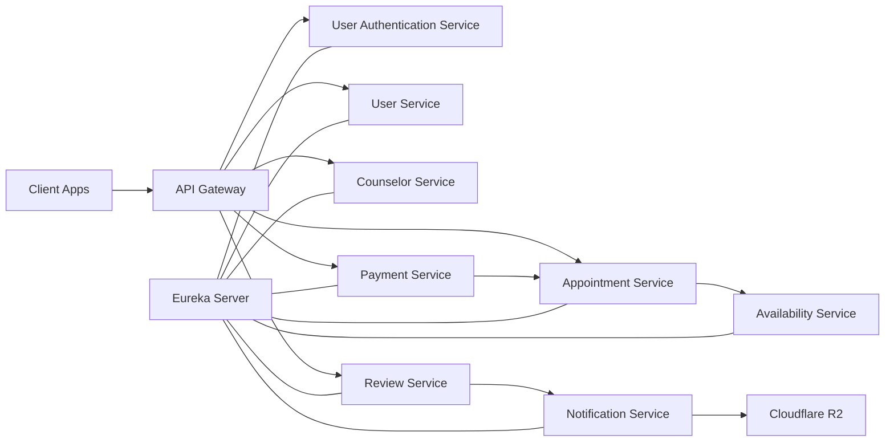
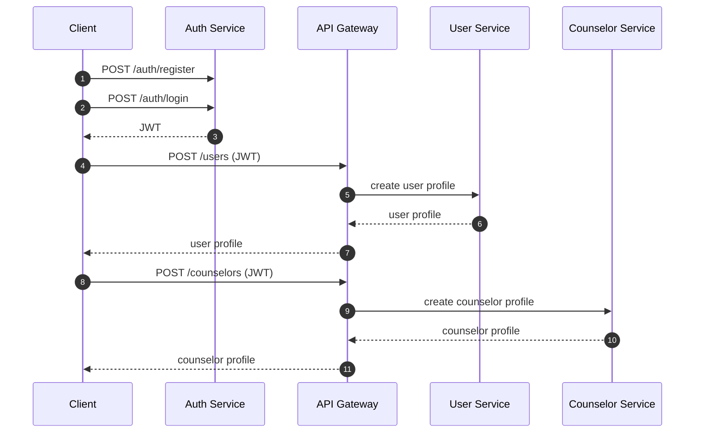
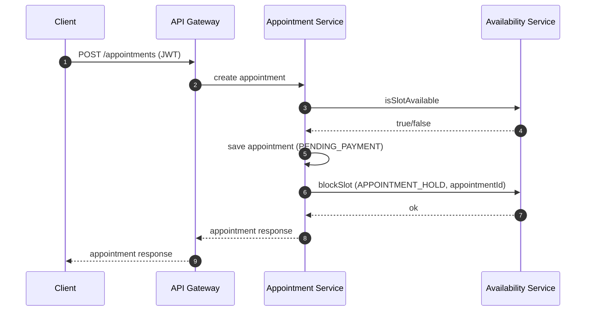
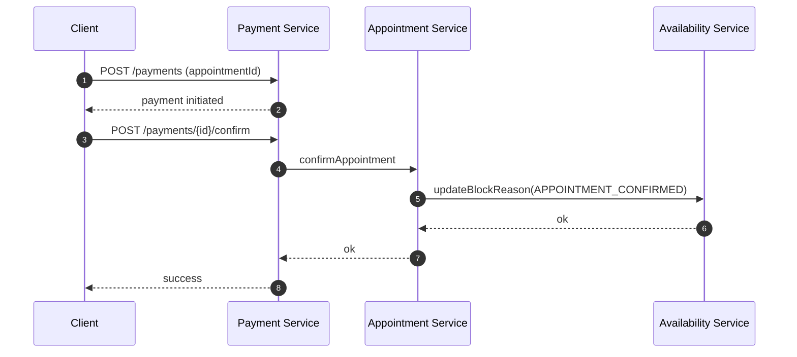
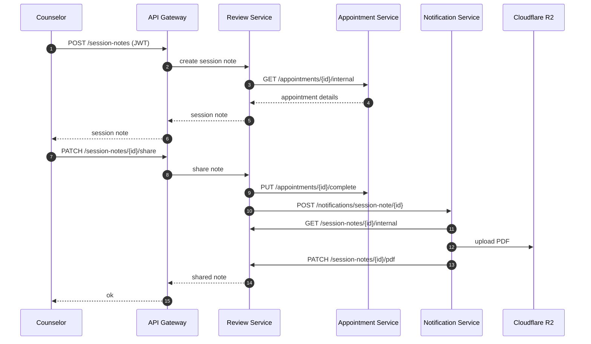
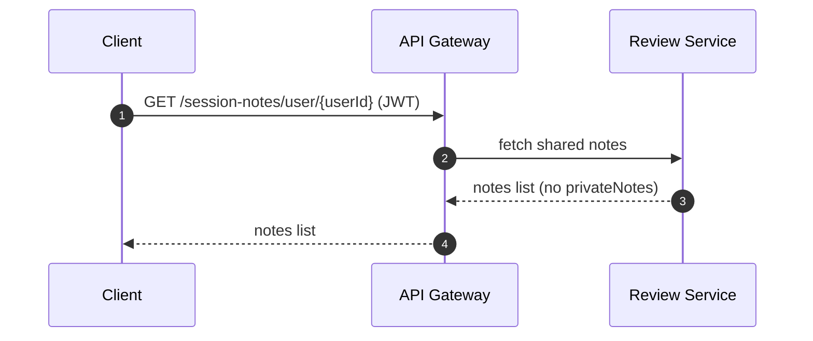
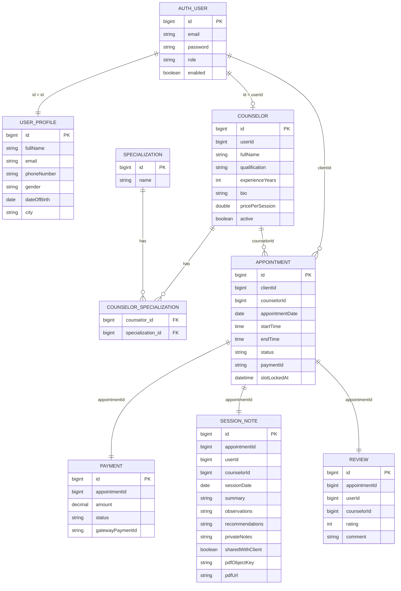

# Architecture

**Purpose**
This document explains the current system architecture, data flows, and service contracts for StackFul Minds.

**System Map**
1. `eureka-server` — service registry
2. `api-gateway` — JWT validation, request routing, basic role gating
3. `user-authentication-service` — auth + JWT issuance
4. `user-service` — client profile
5. `counselor-service` — therapist profile
6. `availability-service` — scheduling rules and slot blocking
7. `appointment-service` — booking orchestration
8. `payment-service` — payment state and confirmation
9. `review-service` — session notes + reviews
10. `notification-service` — PDF upload to R2 and email trigger (placeholder)

**Diagrams**

**System Map**

**Auth And Profile Setup**

**Booking + Availability**

**Payment Confirmation**

**Session Notes And Review**

**Client Note History**

**Database ER (High-Level)**

**Core Data Domains**

**Auth**
1. `auth.users`
   - `id`, `email`, `password`, `role`, `enabled`
2. JWT claims:
   - `userId`, `email`, `role`

**User Profile**
1. `users.users`
   - `id`, `fullName`, `email`, `phoneNumber`, `gender`, `dateOfBirth`, `city`

**Counselor Profile**
1. `counselors`
   - `id`, `userId`, `fullName`, `qualification`, `experienceYears`, `bio`, `pricePerSession`, `active`
2. `specializations`
   - `id`, `name`
3. `counselor_specializations`
   - `counselor_id`, `specialization_id`

**Availability**
1. `counselor_working_hours`
2. `counselor_lunch_breaks`
3. `counselor_unavailability`
4. `public_holidays`

**Appointments**
1. `appointments`
   - `id`, `clientId`, `counselorId`, `appointmentDate`, `startTime`, `endTime`
   - `status`, `paymentId`, `slotLockedAt`

**Payments**
1. `payments`
   - `id`, `appointmentId`, `amount`, `status`, `gatewayPaymentId`

**Session Notes**
1. `session_notes`
   - `appointmentId`, `userId`, `counselorId`, `sessionDate`
   - `summary`, `observations`, `recommendations`, `privateNotes`
   - `sharedWithClient`, `pdfObjectKey`, `pdfUrl`

**Reviews**
1. `reviews`
   - `appointmentId`, `userId`, `counselorId`, `rating`, `comment`

**Service Contracts**

**Auth**
1. `POST /auth/register`
2. `POST /auth/login`

**User Service**
1. `POST /users`
2. `GET /users/me`
3. `PATCH /users/me`
4. `GET /users/{id}/public` (internal)

**Counselor Service**
1. `POST /counselors`
2. `GET /counselors/me`
3. `GET /counselors`
4. `GET /counselors/{id}`
5. `PUT /counselors/{id}`

**Availability Service**
1. `GET /internal/availability/check`
2. `POST /internal/availability/block`
3. `PUT /internal/availability/block/{referenceId}/reason`
4. `POST /internal/availability/free/{referenceId}`
5. `POST /schedule/working-hours/{counselorId}`
6. `POST /schedule/lunch-break/{counselorId}`
7. `POST /schedule/unavailability/{counselorId}`
8. `DELETE /schedule/unavailability/{counselorId}/{unavailabilityId}`
9. `GET /schedule/calendar/{counselorId}`

**Appointments**
1. `POST /appointments`
2. `GET /appointments/client`
3. `GET /appointments/counselor/{counselorId}`
4. `PUT /appointments/{appointmentId}/reschedule`
5. `DELETE /appointments/{appointmentId}`
6. `PUT /appointments/{appointmentId}/confirm`
7. `GET /appointments/{appointmentId}/status`
8. `GET /appointments/{appointmentId}/internal`
9. `PUT /appointments/{appointmentId}/complete`

**Payments**
1. `POST /payments`
2. `POST /payments/{appointmentId}/confirm`
3. `POST /payments/{appointmentId}/fail`

**Review Service**
1. `POST /session-notes`
2. `PUT /session-notes/{id}`
3. `PATCH /session-notes/{id}/share`
4. `PATCH /session-notes/{id}/pdf`
5. `GET /session-notes/user/{userId}`
6. `GET /session-notes/counselor/{counselorId}`
7. `GET /session-notes/appointment/{appointmentId}`
8. `GET /session-notes/{noteId}/internal`
9. `POST /reviews`
10. `GET /reviews/counselor/{counselorId}`
11. `GET /reviews/user/{userId}`

**Notification Service**
1. `POST /notifications/session-note/{noteId}`

**Key Flows**

**1) Auth + Profile Setup**
1. Register + login via auth service
2. Gateway injects headers
3. Create user or counselor profile

**2) Booking**
1. Appointment service checks availability
2. Appointment saved in `PENDING_PAYMENT`
3. Availability slot blocked as `APPOINTMENT_HOLD`

**3) Payment**
1. Payment created (INITIATED)
2. Payment confirmed → appointment confirmed
3. Availability block updated to `APPOINTMENT_CONFIRMED`

**4) Session Notes**
1. Counselor creates note after appointment confirmed/completed
2. Counselor shares note → appointment completed + notification triggered
3. Notification service uploads PDF to R2 and updates review service
4. Client sees note + PDF link in history

**Error Handling**
1. Appointment service: fail fast on availability errors
2. Review service: 404/403/409 with proper error codes
3. Notification service: skips missing notes, logs errors

**Environment Variables**
Notification service requires R2 values:
1. `r2.endpoint`
2. `r2.access-key`
3. `r2.secret-key`
4. `r2.bucket`
5. `r2.public-base-url`
